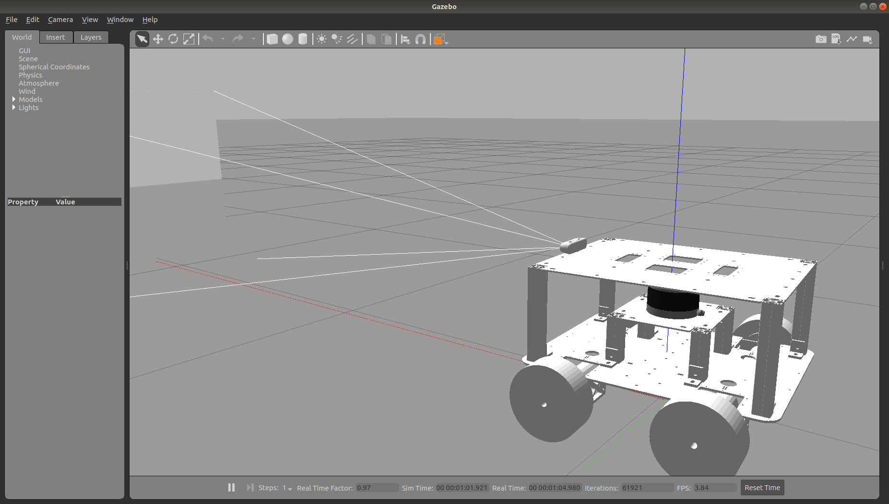
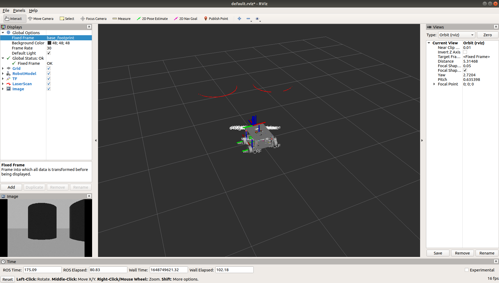
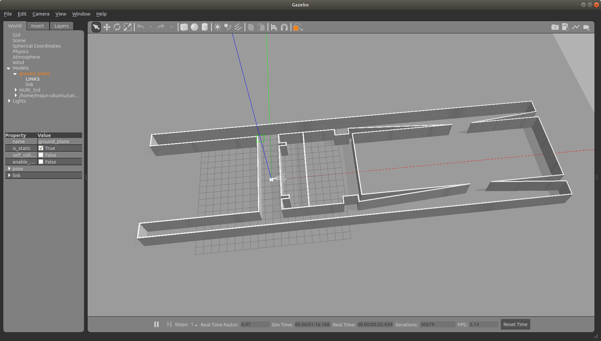
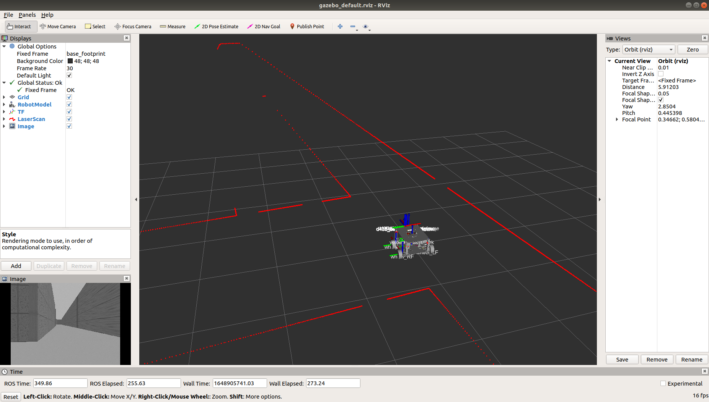

# umrobot_description
**Capstone Design 2022, Universal Mobile Robot Platform for gazebo simulation.**

3D Model Designer: [Taegyeom Gim](https://github.com/GYEOMGYEOM)

---

|||
|---|---|
|OS| Ubuntu 18.04|
|ROS| Melodic|
|Sensor| Realsense|
||2D LiDAR|

# Requirement
[Intel RealSense gazebo plugin](https://github.com/nilseuropa/realsense_ros_gazebo) has to be installed.

# About LiDAR
Used Velodyne VLP-16 3d model, but applied [RPLiDAR S1](https://www.slamtec.com/en/Lidar/S1) spcification.

# Nuri building 3rd floor gazebo world

**2022.04.02**: Updated Nuri building gazebo world(not real size).

