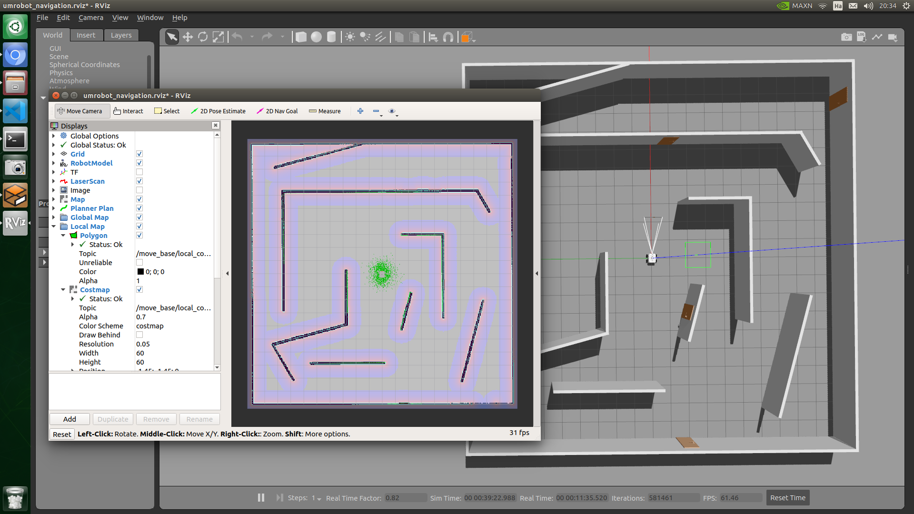

# UMRobot
**Capstone Design 2022, Universal Mobile Robot Platform for gazebo simulation.**

Overall: [Capstone-2022](https://github.com/msjun23/Capstone-2022)

---

|||
|---|---|
|OS| Ubuntu 18.04|
|ROS| Melodic|
|Sensor| Realsense|
||2D LiDAR|

ROS packages for UMRobot gazebo simulation. [umrobot_description](umrobot_description/), [umrobot_navigation](umrobot_navigation/) packages are supplied. [umrobot_cartographer](umrobot_cartographer/) is a ROS package either, but if you want to use this package, have to [build cartographer & cartographer_ros](https://google-cartographer-ros.readthedocs.io/en/latest/compilation.html) first.

