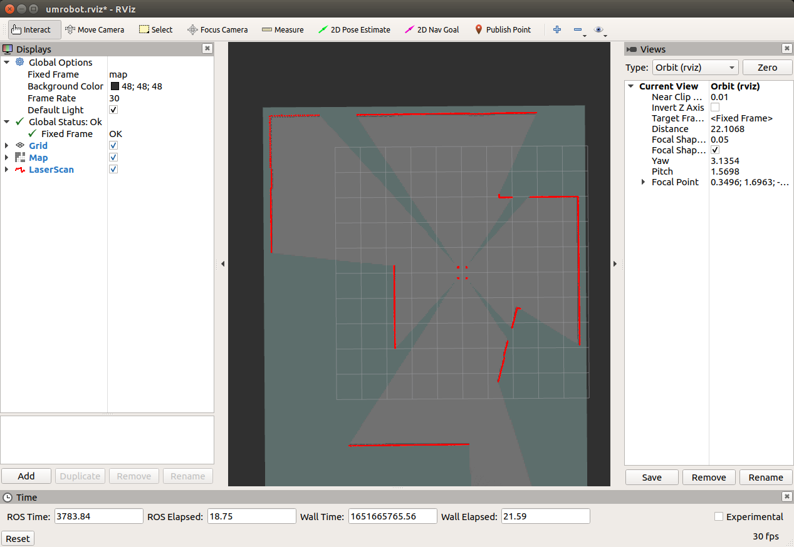

# umrobot_cartographer

UMRobot gazebo simulation use **cartographer** to do mapping.

**This is not a ROS package!**

---

# Prepare Cartographer
[Cartographer](https://google-cartographer-ros.readthedocs.io/en/latest/index.html) is powerful SLAM algorithm, and easy to use.

Cartographer is to be installed. Follow commands at [here](https://google-cartographer-ros.readthedocs.io/en/latest/compilation.html). I recommand you to make another workspace like **carto_ws** only for cartographer, instead of using **catkin_ws**. Because cartographer use little different method to build package, ```catkin_make_isolated --install --use-ninja``` not ```catkin_make```.

Once you complete building cartographer, copy the files at this repo to a folder with the same name in the cartographer_ros package.

> - [configuration_files/*](configuration_files/) -> cartographer_ros/configuration_files/
>
> - [launch/*](launch/) -> cartographer_ros/launch/
>
> - [maps/*](maps/) -> cartographer_ros/maps/ (optional)

# Mapping
Now you can do mapping with the cartographer.

```bash
# Run umrobot gazebo simulation
$ roslaunch umrobot_description umrobot_gazebo.launch

# Mapping with cartographer
$ roslaunch cartographer_ros umrobot.launch
```



# Save the map
To save the map, we use map_server package. map_server package is included in the [ros navigation package](https://github.com/ros-planning/navigation/tree/melodic-devel).

```bash
# Map is saved in current directory
$ rosrun map_server map_saver -f {file name}
```

You can find .pgm and .yaml files for map, and the two files should always exist together.


