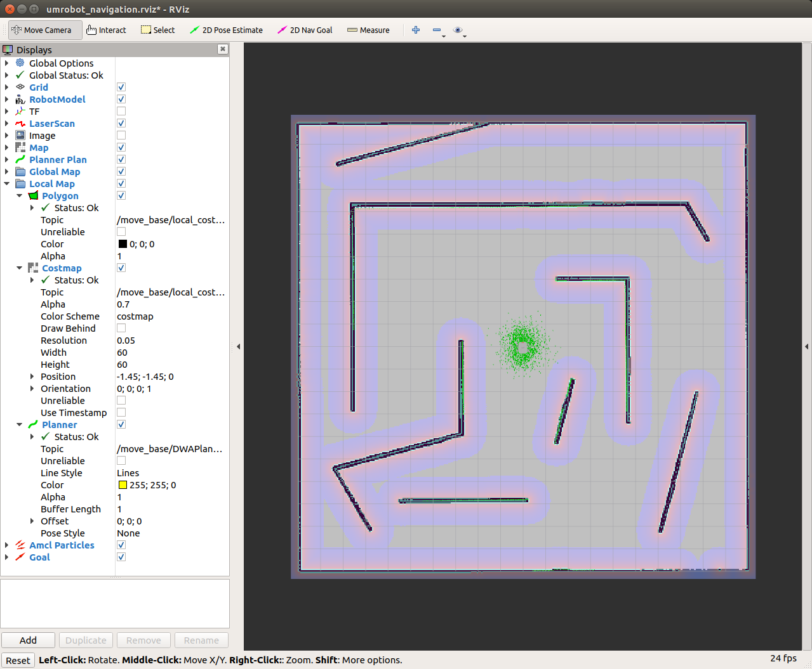

# umrobot_navigation
**Capstone Design 2022, Universal Mobile Robot Platform for gazebo simulation. Navigation package.**

---

|||
|---|---|
|OS| Ubuntu 18.04|
|ROS| Melodic|
|Sensor| Realsense|
||2D LiDAR|

# Requirement
- [ROS Navigation package](https://github.com/ros-planning/navigation/tree/melodic-devel)
```bash
$ cd ~/catkin_ws/src
$ git clone -b melodic-devel https://github.com/ros-planning/navigation.git
$ cd ~/catkin_ws && catkin_make
```

# Test
```bash
$ roslaunch umrobot_navigation umrobot_navigation.launch
```

You can change the map in the [umrobot_navigation.launch](launch/umrobot_navigation.launch) file. This is [random_door.map](maps/random_door.pgm).




